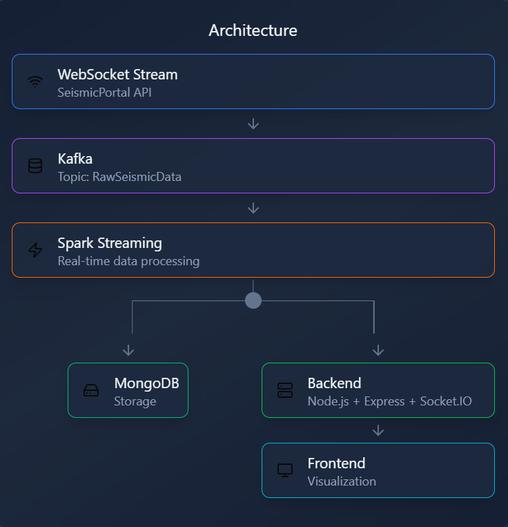

# Seismic Real-Time Pipeline


---
This project implements a **real-time end-to-end data pipeline** for monitoring and visualizing seismic activity.  
It streams earthquake data from the **SeismicPortal WebSocket API**, ingests it into **Kafka**, processes it with **Spark Structured Streaming** and visualizes them on a modern **React dashboard**.

---

## Features

### Seismic Producer
- Connects to the seismic WebSocket stream: `wss://www.seismicportal.eu/standing_order/websocket`
- Receives continuous earthquake data in JSON format
- Publishes events to Kafka topic `RawSeismicData`
- Handles network interruptions and reconnects automatically

### Spark Streaming Processor
- Reads continuously from the Kafka topic
- Parses and processes incoming JSON data
- Prints unique events to console by removing duplicates using event IDs
- Optionally counts the total number of processed events

### Seismic Real-Time Dashboard
#### Backend (Node.js + Express + Socket.IO)

- Provides a Kafka consumer to read real-time seismic events from the RawSeismicData topic.
- Uses Socket.IO to push events to the React frontend in real time.


#### Frontend (React)

- Interactive dashboard built with React + Tailwind CSS.
- Displays:
* Real-time map of earthquakes
* Charts for magnitudes, depths, and regional stats
* Live updates via WebSocket (Socket.IO)
---
## Architecture Diagram

<h2 align="center">Architecture Diagram</h2>

<p align="center">
  
</p>
---

## Requirements

```bash
pip install requirements.txt
```
Ports:
- Kafka: 9092
- Backend (Node.js/Express + Socket.IO): 4000
- Frontend (React): 3000

---
## Installation and Execution

Before starting, make sure Kafka is installed and configured in `C:/Kafka`. Open **new terminals** for each process to run Kafka, Producer, Processor, and Dashboard simultaneously.
### Navigate to Kafka Directory
```bash
cd C:/Kafka
```

### 1. Prepare Kafka
```bash
# Format Kafka storage (KRaft)
.\bin\windows\kafka-storage.bat format -t <CLUSTER_ID> -c .\config\kraft\server.properties
```
(Replace <CLUSTER_ID> with a generated UUID )
```bash
# Start Kafka server
.\bin\windows\kafka-server-start.bat .\config\kraft\server.properties
```
Keep this terminal open, Kafka must be running for the Producer and Processor !
### 2. Activate Python Environment
Open a new terminal in your project folder
```bash
venv\Scripts\activate
```

### 3. Run the Producer
```bash
python seismic_producer.py
```
- Connects to the WebSocket stream
- Publishes events to Kafka (RawSeismicData)
- Example log:

```bash
INFO:root:New event: Mag 4.1 - Region: NEGROS- CEBU REG, PHILIPPINES
```

### 4. Run the Spark Processor
```bash
python spark_streaming_processor.py
```
- Reads Kafka messages
- Displays filtered events (magnitude ≥ 2.0)
- Counts unique events
- Example output:
```bash
EVENT #1
======================================================================
  Magnitude    : 3.0
  Region       : OFFSHORE COQUIMBO, CHILE
  Time         : 2025-11-09T18:32:59.0Z
  Latitude     : -30.12
  Longitude    : -72.03
  Depth        : 48.7 km
  Mag Type     : ml
  Action       : update

```
### 5. Start the Backend (Socket.IO)
```bash
cd backend
node server.js
```
- Backend runs on port 4000
- Emits all received events to connected clients in real time

### 6. Start the React Frontend
```bash
cd frontend
npm start
```
- Frontend runs on port 3000
- Connects to backend via Socket.IO to display live events
- Interactive dashboard updates automatically when new seismic events arrive

#### Notes : 

- All seismic events are displayed regardless of magnitude
- The frontend dashboard stores in memory only the most recent events (default 200)
- Kafka must be running before starting the Producer and Spark Processor
- Spark Structured Streaming reads from `startingOffsets = "earliest"` to capture historical data
- Backend emits events in real time via Socket.IO to connected clients
---

## References
- [Seismic Portal WebSocket API](https://www.seismicportal.eu/realtime.html) – Source of real-time earthquake data
- [KafkaJS Documentation](https://kafka.js.org/) – Node.js Kafka client used in the backend
- [Apache Spark Structured Streaming](https://spark.apache.org/docs/latest/structured-streaming-programming-guide.html) – Real-time data processing
- [React Documentation](https://react.dev/) – Frontend library for dashboard
- [Socket.IO Documentation](https://socket.io/docs/) – Real-time communication between backend and frontend
